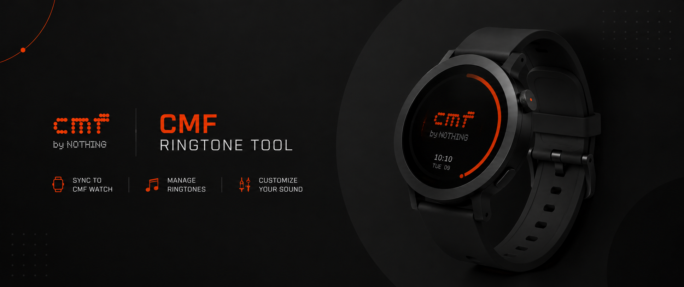

<p align="center">
  
</p>

<h1 align="center">🎵 CMF Ringtone Tool</h1>

<p align="center">
  <strong>Your CMF Watch Pro 2 can play more than the five ringtones it shipped with — this project proves it.</strong><br/>
  A full reverse-engineering of the watch's <code>.act</code> ringtone format, plus the tools to decode it, encode it, splice it, and (soon) beam a custom tone straight onto your wrist over Bluetooth.
</p>

<p align="center">
  <a href="https://github.com/tirodz/CMF-Ringtone-Tool/stargazers"></a>
  <a href="https://github.com/tirodz/CMF-Ringtone-Tool/issues"></a>
  
  
  <a href="LICENSE"></a>
</p>

<p align="center">
  
</p>

<p align="center">
  
  
  
</p>

<p align="center">
  <br/>
  <sub><em>Python research tooling today — Rust + Tauri desktop app incoming</em></sub>
</p>

<p align="center">
  <a href="#-what-is-this">What is this</a> •
  <a href="#-the-toolbox">Toolbox</a> •
  <a href="#-usage">Usage</a> •
  <a href="#-putting-it-on-the-watch-ble-status">BLE status</a> •
  <a href="#-safety--backups">Safety</a> •
  <a href="#-credits">Credits</a>
</p>

---

## 🎧 What is this?

The CMF Watch Pro 2 (Nothing's budget-friendly smartwatch) comes with a handful of built-in ringtones and **no official way to add your own**. The tones live on the watch's flash as `.act` files — a format nobody had documented, produced by an encoder nobody outside Actions Technology has.

So this project did the fun thing: it took the format apart, byte by byte, until it gave up its secrets. The result is a small, honest toolchain that can:

- 🔓 **Decode** any `.act` ringtone back into a normal WAV you can listen to
- 🎚️ **Encode** your own audio (WAV today, MP3/OGG/FLAC support in progress) into a real `.act` file
- ✂️ **Splice** existing tones together into new combinations
- 📦 **Repack** the watch's firmware image with a replaced ringtone
- 📡 **Install** it over Bluetooth — no disassembly, no debug cables (currently being validated)

Everything here was figured out from the stock firmware and public SDKs. No NDAs were harmed.

## ⌚ Compatibility

| Device / firmware | Status |
|---|---|
| **CMF Watch Pro 2** (Actions ATS3089C, Zephyr) | ✅ Target device. All analysis and validation done against its stock firmware. All 12 stock tones decode cleanly. |
| Tuya ZS308B SDK `.act` samples | ✅ All 10 decode cleanly (same codec, no XOR layer) |
| Other ATS308x-based watches | 🧪 Very likely the same codec, but **untested** — don't assume |
| Other CMF / Nothing devices | ❓ Unknown — no claims until tested |

If you try this on different hardware or a different firmware version, please open an issue and share what you found — even "it did nothing" is useful data.

## 🧩 What on earth is `.act`?

`.act` is an **Actions Technology "actii"** audio bitstream — a proprietary, CELP-family parametric *speech* codec that CMF/Nothing (mis)uses for ringtones. A few things make it unusual:

- **It's obfuscated, but charmingly badly.** Every byte on flash is XORed with a repeating 2-byte key (`57 2a`). Raw streams start with the magic `e1 d3`; on-flash files start with `b6 f9`. That's the whole "protection".
- **It's tiny.** 16 kHz, mono, **16 kbps** — 20-byte frames, each carrying 10 ms of audio (160 samples). A whole ringtone is about 15 KB.
- **Nobody publishes an encoder.** The only public decoder is a compiled ARM library (`a1_act_d.a`) buried in the Actions SDK. The encoder is an internal Actions PC tool. So this repo runs the original decoder *under CPU emulation*, and builds an encoder by reverse-engineering what the decoder expects.

## 🔊 ACT v4 at a glance

| Layer | Bytes | Notes |
|---|---|---|
| On-flash container | — | Raw stream XOR `57 2a` (repeating) |
| Magic | `e1 d3` | v4, fixed 16 kHz mono (v1–v3 and a newer selectable-rate container also exist) |
| Frame | 20 B | → 160 samples (10 ms) |
| Sync frame | starts `b2 dd 03 42` | Re-init marker; first frame of every file + periodic |
| EOF | short final read | Decoder treats it as clean end-of-stream |

Each 160-bit frame packs 22 fields: LSP spectral-envelope indices (split-VQ), pitch lag/gain for two subframes, and a 2-pulses-per-track algebraic fixed codebook with log-domain gains. The full, evidence-linked field map is in [`act_emu/REPORT.md`](act_emu/REPORT.md).

## 🛠️ The toolbox

| Tool | What it does | Status |
|---|---|---|
| `act_emu/act_decode.py` | `.act` → WAV, using the *original* Actions decoder running under Unicorn CPU emulation. Auto-detects the XOR layer. | ✅ All 22 known files decode 100% |
| `act_emu/act_encode.py` | Audio → ACT v4 encoder, built by inverting the decoder field by field. WAV/PCM input today; **MP3/OGG/FLAC and friends in progress** (via format conversion) | 🚧 Works, quality improving (see below) |
| `act_emu/act_splice.py` | Builds valid custom `.act` files by splicing segments of stock tones | ✅ Verified end-to-end |
| `act_emu/fwmod.py` | Extract / replace / rebuild the `sdfs_k` partition and AOTA firmware container with valid CRC32s | ✅ Round-trip byte-for-byte verified |
| `act_emu/cmf_shell.py` | BLE debug-shell client for the watch (read-only recon) | 🧪 Pending first on-device run |
| `act_emu/cmf_flash_plan.py` | Offline planner: generates the exact `mww`/`snandw` command lists for a BLE-only ringtone swap | ✅ Offline plan validated |
| `act_emu/test_encoder.py` | Encoder regression suite (encode → original decoder round-trip) | ✅ All tests pass |
| `act_emu/armlink.py` + friends | The archaeology kit: ARM/Thumb ELF linker, disassembler, tracer, oracle harness used to crack the format | 🔬 Research tooling |

## 🎚️ How the encoder works (and where it still struggles)

There's no official encoder, so `act_encode.py` is a genuine analysis-by-synthesis encoder built from scratch:

1. **Spectral envelope** — 16th-order LPC (Levinson) → line spectral frequencies → quantized with the decoder's exact split-VQ tables and MA-prediction, tracking decoder state bit-for-bit.
2. **Excitation** — the LPC residual is mapped onto the fixed codebook's 2-pulses-per-track structure using an empirically extracted pulse map (512 values per field, measured from the real decoder).
3. **Gains** — the decoder's log-domain interpolation table was fully reversed and calibrated against output loudness, with optional closed-loop refinement through the emulated original decoder.
4. **Pitch (adaptive codebook)** — currently **disabled**. The field→lag map is measured but too noisy to trust yet, so tonal content is carried by the spectral envelope alone.

**The honest status:** everything the encoder produces decodes cleanly through the *original* Actions decoder — tones come out at the right pitch (zero-crossing tracked), right duration, right loudness, and silence stays silent. But waveform-level SNR for tonal content is still negative, because without the pitch track the decoder can't phase-align voiced sounds. That's the remaining quality blocker, and it's the active work item. For a wrist-speaker ringtone it's already closer than you'd think — check `artifacts/melody_in.wav` vs `artifacts/melody_out.wav`.

## ✅ Testing & validation

Nothing here is "should work" — it's all executed and measured:

- 🧪 **Decoder**: 22/22 known `.act` files (12 from the watch, 10 SDK samples) decode with 100% byte consumption and coherent PCM.
- 🧪 **Encoder** (`test_encoder.py`, all passing): silence stays silent (RMS 8), 200/440/1000/3000 Hz sines come out at 217/452/973/3183 Hz, noise bursts stay stable, a 3-second clip encodes to 300 frames without drift, and a stock ringtone survives a full re-encode round-trip.
- 🧪 **Firmware packer**: modified AOTA images re-parse, all CRC32s valid, round-trip byte-for-byte identical.
- 🧪 **BLE flash plan**: the simulated post-write partition passes the real SDFS parser, all three checksum fields match, all 16 untouched files stay byte-identical, and the new ringtone decodes error-free.

## 📁 Repository structure

```
act_emu/          All the tools + the full technical report (act_emu/REPORT.md)
act_emu/wav/      Decoded reference WAVs of every known stock .act
artifacts/        Generated example: custom ring1.act + BLE staging command lists
docs/             README assets (banner)
```

## 📦 Getting started

**Requirements:** Python 3, plus:

```bash
pip install unicorn capstone bleak
```

- `unicorn` + `capstone` — CPU emulation and disassembly (decoder, encoder, research tools)
- `bleak` — Bluetooth Low Energy (the on-watch tools only)

**Two things are deliberately *not* in this repo**, because they're proprietary to Actions/CMF/Nothing:

1. **The Actions decoder library** (`a1_act_d.a` from the [Actions SDK](https://github.com/lvgl/lv_port_actions_technology)) — needed to reproduce the decoder-emulation linking step:
   ```bash
   cd /tmp/actdec && ar x <sdk>/framework/media/libal/a1_act_d.a
   python3 armlink.py /tmp/actdec/*.o linked.json
   ```
   (`linked.json` is already committed, so decoding works out of the box — you only need this to reproduce the linking step.)
2. **The stock firmware** (`original.bin`) — needed for firmware repacking and BLE flash planning. Obtain it from your own watch or the community firmware dump linked below. It is proprietary to CMF/Nothing, and large, so it will never be committed here.

## 🚀 Usage

**Decode a ringtone to WAV** 🎧
```bash
python3 act_emu/act_decode.py ring1.act ring1.wav
```

**Encode your own audio to ACT** 🎚️
```bash
# WAV (16 kHz, mono, 16-bit PCM) goes straight in
python3 act_emu/act_encode.py mysong.wav mysong.act

# MP3 / OGG / FLAC / anything? Convert first (ffmpeg or any tool):
ffmpeg -i mysong.mp3 -ar 16000 -ac 1 mysong.wav
python3 act_emu/act_encode.py mysong.wav mysong.act
```
Multi-format input is being wired in natively too — for now it's a one-line pre-convert.

**Splice stock tones into a custom ringtone** ✂️
```bash
python3 act_emu/act_splice.py custom.act ring1.act ring4.act
```

**Repack a firmware image with your ringtone** 📦
```bash
python3 act_emu/fwmod.py original.bin --list                              # inspect
python3 act_emu/fwmod.py original.bin --replace ring1.act=custom.act --out modified_aota.bin
```

**Run the encoder test suite** 🧪
```bash
python3 act_emu/test_encoder.py
```

**BLE recon against a live watch (read-only)** 📡
```bash
python3 act_emu/cmf_shell.py --address XX:XX:XX:XX:XX:XX recon
```

**Generate a BLE flash plan** 🗺️
```bash
python3 act_emu/cmf_flash_plan.py original.bin ring1_custom.act
```

## 🔬 Reverse-engineering notes

The full story — how the XOR layer was spotted, how the decoder library was statically linked and emulated, how every bit field of the frame was mapped, the codec tables, the BLE shell discovery, and the complete chain of evidence — lives in [`act_emu/REPORT.md`](act_emu/REPORT.md). If you like that sort of thing, it's a fun read.

## 📡 Putting it on the watch (BLE status)

This is where honesty matters most. Here's exactly what is confirmed and what is not:

**✅ Confirmed (static analysis + offline execution):**

- The production firmware exposes a **full Zephyr debug shell over BLE** — including `mdw`/`mww` (RAM read/write), `snandr`/`snandw` (raw NAND read/write through the FTL), and `sdfs` (dump any file by name — a built-in backup primitive).
- The complete ringtone-swap procedure (recon → stage → write → patch checksums → verify) has been planned command-by-command, and the simulated result passes every offline check.

**🧪 Experimental / not yet verified:**

- **Nothing has been flashed to a physical watch.** Not once. The on-device steps are pending a first, read-only recon run to confirm the debug commands are actually enabled on live hardware and to read out the real partition offset (`PBASE`).
- The normal CMF BLE protocol (the one Gadgetbridge speaks) has **no** generic file-write command — the debug shell is the only known BLE write path, which is why it's experimental territory.

In short: the road is mapped and the car is built, but it hasn't left the garage yet. 🚗

## ⚠️ Safety & backups

Playing with raw flash writes is inherently risky. If you go near the write path:

- **Back up first.** `sdfs ring1.act 15556` dumps the stock ringtone straight off the watch; keep it (and a stock firmware dump) somewhere safe before changing anything.
- **Writes go through the FTL** (sector-aligned, ECC, bad-block management) — the same path the OS itself uses, so a correctly-placed write isn't inherently destructive. A *misplaced* one can be.
- **Biggest risks:** a wrong partition offset (mitigated: read-back verification before every write) and power loss mid-write (mitigated: only two small regions are touched, and the stock tone can be restored the same way).
- **First on-device test should be harmless** — e.g. change the `sdfs.txt` test string, not the ringtone.
- You do this **at your own risk**. Bricking your watch is unlikely if you follow the procedure carefully, but "unlikely" is not "impossible".

## 🤝 Contributing

Contributions are very welcome — this is a research project and there's plenty left to do:

- 🎚️ Calibrate the pitch field→lag map and enable the adaptive codebook (the encoder quality blocker)
- ⌚ Test decoding/tools against other ATS308x devices and firmware versions
- 📡 Carefully validate the BLE write path on real hardware (read-only recon first!)
- 📝 Docs, tests, cleanups — all good

Open an issue before big changes so we don't duplicate effort. Please keep the tone of this repo: **claims backed by execution, and clear labels on anything unverified.**

## 🙏 Credits

This project stands on public third-party work — huge thanks to all of them (not vendored here, clone separately):

- [whatotter/cmf-watch-firmware](https://github.com/whatotter/cmf-watch-firmware) @ `fd8c708` — stock firmware + extract script
- [freethinkel/fmc](https://github.com/freethinkel/fmc) @ `59ec4cd` — BLE watchface protocol research
- [Freeyourgadget/Gadgetbridge](https://github.com/Freeyourgadget/Gadgetbridge) @ `a0948ee` — CMF BLE protocol implementation
- [lvgl/lv_port_actions_technology](https://github.com/lvgl/lv_port_actions_technology) @ `26f51e5` — Actions SDK (decoder lib, SPI NAND driver)
- [ambraglow/cmfparser](https://github.com/ambraglow/cmfparser) @ `6781fc6`
- [purrrock/ATS3085S_firmware_packer](https://github.com/purrrock/ATS3085S_firmware_packer) @ `e9c3fda`
- [Viper7000/ATS3085S_firmware_unpacker](https://github.com/Viper7000/ATS3085S_firmware_unpacker) @ `92fda90`

The ACT decoder binary (`a1_act_d.a`) is © Actions Technology; the CMF firmware is © CMF/Nothing. Both remain the property of their respective owners and are used here solely for interoperability research.

## 📄 License

**GPL-3.0** — free software: use it, break it, improve it, share it. The full text lives in [`LICENSE`](LICENSE).

Third-party components and upstream projects listed in [Credits](#-credits) remain under their own licenses. The ACT decoder binary (`a1_act_d.a`) is © Actions Technology; the CMF firmware and trademarks are © CMF/Nothing.

---

<p align="center">
  <em>Not affiliated with, endorsed by, or connected to Nothing Technology or CMF.<br/>
  "CMF", "Nothing" and the watch itself belong to their respective owners.<br/><br/>
  Made with ☕, a disassembler, and an unhealthy amount of curiosity.</em>
</p>
